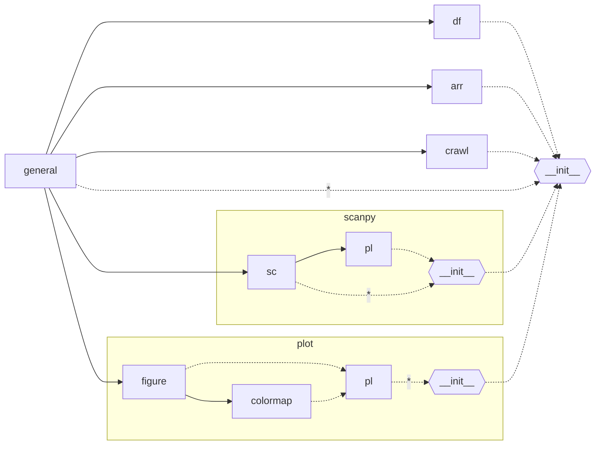

# csMAHN_Spatial
perform csMAHN to integrate trans-species spatial transcriptome data


># utils




为了解决不同的jupyter kernel中包的安装情况不同而无法导入utils的问题

借助`module_exists`判断包是否存在，进而决定是否导入子模块

当子模块的核心包不存在时，将提示信息存入预期名称

```python
from utils.general import *
with Block('[import utils.plot]',context={
    'module':'matplotlib,seaborn'.split(',')
}) as context:
    if all([ module_exists(_) for _ in context.module]):
        import utils.plot as pl
    else:
        pl = '[module has not installed] {}'.format(','.join(context.module))

```

> ## 使用建议

于工作目录的根目录下额外创建`init.py`,并在其中完成

+ 导入`utils`

+ 做包名暴露

+ 全局定义变量

+  ...

```python
# init.py

import sys
from pathlib import Path
p_temp = Path('~/link/csMAHN_Spatial').expanduser() # utils所在目录
sys.path.append(str(p_temp)) if not str(p_temp) in sys.path else None
del p_temp

import utils as ut
from utils.general import *

_temp = np.array([_ for _ in dir(ut.general) if not _.startswith('_')])
print('\n[names import from utils.general]\n'.center(150,'-'))
for _ in np.array_split(_temp,max(2,np.ceil(_temp.size//4))):
    print('  {}'.format(' '.join(_)))
del _temp


# 包名暴露
with Block('[import utils.scanpy]',context={
    'module':'scanpy'.split(',')
}) as context:
    if all([ module_exists(_) for _ in context.module]):
        sc = ut.sc.sc
    else:
        sc = ut.sc


with Block('[import utils.plot]',context={
    'module':'matplotlib,seaborn'.split(',')
}) as context:
    if all([ module_exists(_) for _ in context.module]):
        pl = ut.pl.pl
    else:
        pl = ut.pl

# 定义全局变量
p_root = Path('~/link/csMAHN_Spatial').expanduser()
p_cache = p_root.joinpath('dataset/cache')

[_.mkdir(parents=True,exist_ok=True) for _ in [p_cache]]
```

---
---
---

```python

# 分析脚本
import sys
from pathlib import Path
p_root = Path('~/link/csMAHN_Spatial').expanduser() # init.py所在目录
sys.path.append(str(p_root)) if not str(p_root) in sys.path else None

from init import *
```
